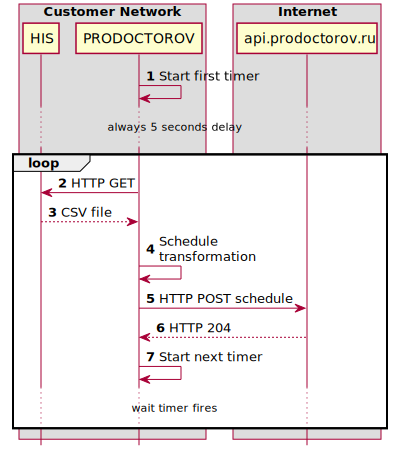

:MODULE: PRODOCTOROV

= {MODULE} image:https://goreportcard.com/badge/github.com/mkv/prodoctorov[]
:lang: ru

:appendix-caption: Приложение
:example-caption: Пример
:figure-caption: Рисунок
:last-update-label: Обновлено
:listing-caption: Листинг
:table-caption: Таблица
:toc-title: Содержание
:version-label: Версия

== Описание

Сервис предназначен для экспорта расписания приема врачей из медицинской информационной системы (МИС, англ. Hospital Information System (HIS)) во внешнюю систему/сайт отзывов о врачах.

МИС построена на базе сервера Lotus Domino и экспортирует расписание в виде CSV файла доступного по HTTP.
Внешняя система предоставляет REST API для загрузки расписания врачей (https://api.prodoctorov.ru/v2).

На рисунке "<<OVERVIEW>>" показаны акторы системы и их взаимодействие.

[[OVERVIEW]]
.Общая схема решения

Команда запуска имеет единственный параметр которым можно задать расположение конфигурационного файла:

[source,shell script]
----
prodoctorov -config=cfg/config.yaml
----

== Настройка сервиса

Дял настройки сервиса

.Пример содержимого файла настроек сервиса {MODULE}.
[source,yaml]
----
---
log_level: debug
start_every_minutes: 5 # time to sleep between schedule uploads

domino: # schedule download server
  url: "http://127.0.0.1/db.nsf/doctors_schedule?openagent"
  raw_schedule_copy_dir: /tmp # optional directory for dumping downloaded schedule

prodoctorov: # schedule upload server
  filial_name: "OOO HealthCare"
  url: "https://api.prodoctorov.ru/v2/doctors/send_schedule/"
  token: "35a322a37e6fb34b2aaea6f4ed30aa7f"
  upload_data_copy_dir: /tmp # optional directory for dumping prepared to upload schedule
----

Описание настроек:

- "*log_level*" - уровень логирования, доступны значения: debug, info, warn, error.
- "*start_every_minutes*" - периодичность с которой запускается экспорт, таймер перезапускается после окончания каждой попытки.
- "*domino.url*" - URL для получения расписания из МИС.
- "*domino.raw_schedule_copy_dir*" - если задано, директория для сохранения расписания, в виде полученном от МИС.
- "*prodoctorov.filial_name*" - наименование лечебного учреждения.
- "*prodoctorov.url*" - URL для отправки расписания врачей.
- "*prodoctorov.token*" - API-токен для аутентификации и авторизации на внешнем сервисе.
- "*prodoctorov.upload_data_copy_dir*" - если задано, директория для сохранения расписания подготовленного для отправки на внешний сервис.
